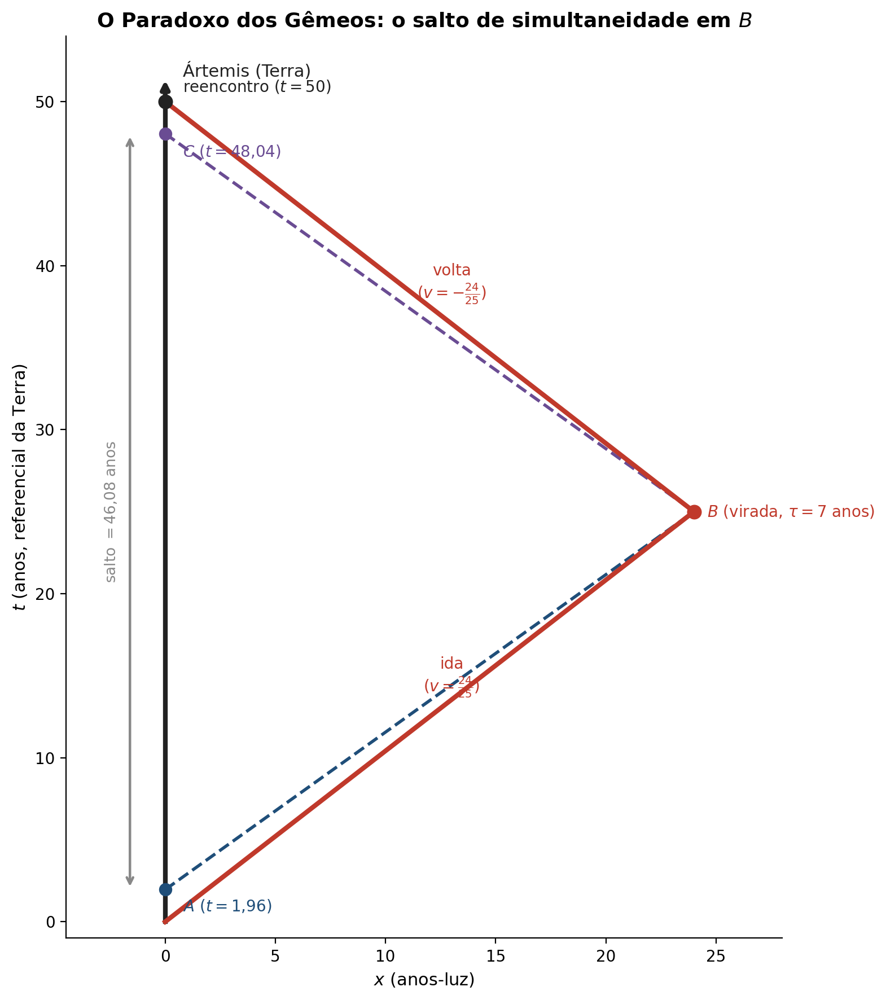

# O Paradoxo dos Gêmeos

Luana M. Souza

*Seção 1.11 e Apêndice 1.13 de Bernard Schutz: por que os "paradoxos" da relatividade não são contradições, e a dissecação completa do paradoxo dos gêmeos*

> **Antes de começar:** este post fecha a série sobre o Capítulo 1 de Schutz. Ele usa diretamente a dilatação do tempo de [Hipérboles Invariantes](../hiperboles), a relatividade da simultaneidade de [Geometria do Espaço-Tempo](../relogio-de-luz), e a transformação de Lorentz de [Transformações de Lorentz](../lorentz). Se alguma dessas ideias estiver enferrujada, vale revisitar antes de continuar.

---

## 1. Por que os "paradoxos" da relatividade não são paradoxos de verdade

Textos introdutórios de Relatividade Restrita costumam apresentar uma lista de problemas batizados de "paradoxos": o paradoxo dos gêmeos, o paradoxo do bastão e o celeiro, o paradoxo da "guerra no espaço", entre outros. Para Schutz, **esses paradoxos são apenas aparentes, nunca contradições reais**.

A origem de todos eles é a mesma: alguém mistura, sem perceber, conceitos newtonianos (um tempo universal, uma noção de simultaneidade absoluta, válida para todo mundo) com a geometria do espaço-tempo de Minkowski. Quando o problema é tratado com rigor, usando os diagramas de espaço-tempo e as ferramentas que já corretas, **nenhuma inconsistência matemática sobra**. A Relatividade Restrita é um modelo perfeitamente consistente, testado repetidamente em física de partículas e astrofísica.

O paradoxo dos gêmeos é o exemplo mais famoso, e vale a pena dissecá-lo por completo.

---

## 2. O paradoxo dos gêmeos: o problema

Considere duas gêmeas:

- **Ártemis** fica na Terra, em repouso, no referencial inercial $O$.
- **Diana** viaja num foguete a uma velocidade $v$ (em unidades com $c=1$):

$$
v = \dfrac{24}{25} = 0,96
$$ 

Do ponto de vista de Diana:

- Ela viaja **7 anos do seu próprio tempo** (tempo próprio $\tau$) na ida.
- Num evento $B$, ela **inverte instantaneamente** a direção do movimento.
- Ela viaja mais **7 anos do seu próprio tempo** na volta.
- Tempo total acumulado no relógio de Diana: $\Delta\tau_{\text{Diana}} = 14$ anos.

Quando as duas se reencontram na Terra, quem está mais velha?

### O cálculo

O fator de Lorentz para $v=24/25$ é:

$$\gamma = \frac{1}{\sqrt{1-v^2}} = \frac{1}{\sqrt{1 - 0{,}9216}} = \frac{1}{\sqrt{0{,}0784}} = \frac{1}{0{,}28} = \frac{25}{7} \approx 3{,}571$$

Para o referencial de Ártemis, cada trecho da viagem de Diana dura $\gamma$ vezes mais tempo do que os 7 anos de tempo próprio dela:

$$\Delta t_{\text{Ártemis por trecho}} = \gamma\Delta\tau_{\text{Diana por trecho}} = \frac{25}{7}\times 7 = 25 \text{ anos}$$

Com dois trechos (ida e volta):

$$\boxed{\Delta t_{\text{Ártemis}} = \gamma\Delta\tau_{\text{Diana}} = \frac{25}{7}\times 14 = 50 \text{ anos}}$$

**No reencontro: Ártemis envelheceu 50 anos e Diana, apenas 14.**

---

## 3. Por que não há simetria entre as duas gêmeas

Essa é a pergunta que todo mundo faz na primeira vez que vê esse resultado: por que Diana não pode alegar, com o mesmo direito, que é **Ártemis** quem deveria ter envelhecido menos? Afinal, do ponto de vista de Diana, é a Terra que se afasta e depois se aproxima.

A resposta está numa diferença física real entre as duas trajetórias, não numa escolha arbitrária de quem é "o observador certo". Lembra da discussão sobre reciprocidade da dilatação do tempo no primeiro post desta série? Lá, o argumento de que "cada um vê o relógio do outro atrasado, sem contradição" **só funciona quando os dois observadores permanecem inerciais o tempo todo**. E é exatamente isso que não acontece aqui:

- **Ártemis** permanece no mesmo referencial inercial $O$ do início ao fim.
- **Diana** ocupa **dois referenciais inerciais diferentes**: $\bar O$ na ida (movendo-se a $+v$) e $\bar{\bar O}$ na volta (movendo-se a $-v$). O evento $B$, onde ela inverte o sentido, envolve uma aceleração, uma **mudança abrupta de referencial inercial**.

Essa assimetria quebra a simetria do argumento de reciprocidade. Não existe um "referencial de Diana" único e contínuo que dure a viagem inteira, existem dois, costurados num instante de aceleração. É essa costura que esconde a resposta para a próxima pergunta, talvez a mais importante de todas.

---

## 4. Onde exatamente os 36 anos "extras" de Ártemis se escondem?

Se Diana, durante cada trecho da viagem (vista continuamente do seu próprio referencial inercial), enxerga o relógio de Ártemis andando mais devagar (exatamente como no argumento de reciprocidade do primeiro post), como é que Ártemis termina **mais velha**? A resposta está no que acontece bem no instante da virada, em $B$: um **salto na linha de simultaneidade** de Diana.

## Dados do problema

No referencial da Terra $O$:

- Ártemis está em $(x = 0)$ (linha contínua preta na vertical).
- O evento de virada é em $B = (t_B, x_B) = (25, 24)$.
- Diana, na ida (linha de simultaneidade tracejada azul), está no referencial $\bar O$, com velocidade:

$$
v = 24/25
$$

## Ida! 

O fator de Lorentz é:

$$
\gamma = 1/\sqrt{1 - v^2} = 25/7
$$

A transformação de Lorentz de $O$ para $\bar O$ é:

$$
\bar t = \gamma(t - vx),
\qquad
\bar x = \gamma(x - vt)
$$

---

## O tempo próprio de Diana em $B$

Aplicamos Lorentz ao evento $B = (25, 24)$ para achar o tempo $\bar t$ de Diana:

$$
\bar t_B = \gamma(t_B - v x_B)
$$

Substituindo:

$$
\bar t_B = (25/7)\left(25 - (24/25)\cdot 24\right).
$$

Então:

$$
\bar t_B = (25/7) \cdot (49/25) = 7 \text{ anos}.
$$

Ou seja, Diana envelheceu **7 anos** até a virada.

---

## Identificando o evento $A$

O evento $A$ é, por definição, o evento na linha de universo de Ártemis $(x = 0)$ que Diana considera **simultâneo** a $B$.

“Simultâneo no referencial de Diana” significa:

$$
\bar t_A = \bar t_B.
$$

Já temos $\bar t_B = 7$. Então exigimos:

$$
\bar t_A = 7.
$$

---

## Aplicando Lorentz ao evento $A$

O evento $A$ tem coordenadas $(t_A, 0)$ no referencial da Terra, porque Ártemis está em $(x = 0)$.

Aplicando Lorentz:

$$
\bar t_A = \gamma(t_A - v \cdot 0) = \gamma t_A.
$$

Logo:

$$
\bar t_A = \gamma t_A.
$$

---

## Igualando e resolvendo para $t_A$

Como $\bar t_A = \bar t_B$:

$$
\gamma t_A = \bar t_B.
$$

Substituindo $\gamma = 25/7$ e $\bar t_B = 7$:

$$
(25/7) t_A = 7.
$$

Multiplicando os dois lados por $7/25$:

$$
t_A = (7 \cdot 7)/25 = 49/25.
$$

Portanto:

$$
\boxed{t_A = 1,96 \text{ anos}}.
$$

---

## Resumo do raciocínio

1. Lorentz em $B$ dá o tempo próprio de Diana: $\bar t_B = 7$ anos.
2. Simultaneidade em Diana significa $\bar t_A = \bar t_B = 7$.
3. Lorentz em $A = (t_A, 0)$ dá $\bar t_A = \gamma t_A$.
4. Igualando: $\gamma t_A = 7 \Rightarrow t_A = 49/25 = 1,96$ anos.

---

## 5. E na volta?

No referencial da Terra $O$:

- Ártemis está em $(x = 0)$ (linha contínua preta na vertical).
- O evento de virada é em $B = (t_B, x_B) = (25, 24)$.
- Diana, na volta (linha de simultaneidade tracejada lilás), está no referencial $\bar{\bar O}$, com velocidade:

$$
v = 24/25
$$

## Volta!

O fator de Lorentz é:

$$
\gamma = 1/\sqrt{1 - v^2} = 25/7
$$

A transformação de Lorentz de $O$ para $\bar{\bar O}$ é:

$$
\bar{\bar t} = \gamma(t + vx),
\qquad
\bar{\bar x} = \gamma(x + vt)
$$

---

## O tempo coordenado de Diana em $B$

Aplicamos Lorentz ao evento $B = (25, 24)$ para achar o tempo $\bar{\bar t}$ de Diana no referencial de volta:

$$
\bar{\bar t}_B = \gamma(t_B + v x_B)
$$

Substituindo:

$$
\bar{\bar t}_B = (25/7)\left(25 + (24/25)\cdot 24\right).
$$

Então:

$$
\bar{\bar t}_B = (25/7) \cdot (1201/25) = 1201/7 \approx 171 \text{ anos}.
$$

Esse é o tempo coordenado do evento $B$ no referencial de volta.

---

## Identificando o evento $C$

O evento $C$ é, por definição, o evento na linha de universo de Ártemis $(x = 0)$ que Diana considera **simultâneo** a $B$.

“Simultâneo no referencial de Diana” significa:

$$
\bar{\bar t}_C = \bar{\bar t}_B.
$$

Já temos $\bar{\bar t}_B = 1201/7$. Então exigimos:

$$
\bar{\bar t}_C = 1201/7.
$$

---

## Aplicando Lorentz ao evento $C$

O evento $C$ tem coordenadas $(t_C, 0)$ no referencial da Terra, porque Ártemis está em $(x = 0)$.

Aplicando Lorentz:

$$
\bar{\bar t}_C = \gamma(t_C + v \cdot 0) = \gamma t_C.
$$

Logo:

$$
\bar{\bar t}_C = \gamma t_C.
$$

---

## Igualando e resolvendo para $t_C$

Como $\bar{\bar t}_C = \bar{\bar t}_B$:

$$
\gamma t_C = \bar{\bar t}_B.
$$

Substituindo $\gamma = 25/7$ e $\bar{\bar t}_B = 1201/7$:

$$
(25/7) t_C = 1201/7.
$$

Multiplicando os dois lados por $7/25$:

$$
t_C = 1201/25.
$$

Portanto:

$$
\boxed{t_C = 48,04 \text{ anos}}.
$$

---

### O salto será:

$$
\Delta t_{\text{salto}} = t_C - t_A = 46,08 \text{ anos}.
$$

É aí que estão escondidos os $46$ dos $50$ anos de Ártemis.

## Resumo do raciocínio

1. Lorentz em $B$ dá o tempo coordenado de Diana na volta: $\bar{\bar t}_B = 1201/7$ anos.
2. Simultaneidade em Diana significa $\bar{\bar t}_C = \bar{\bar t}_B = 1201/7$.
3. Lorentz em $C = (t_C, 0)$ dá $\bar{\bar t}_C = \gamma t_C$.
4. Igualando: $\gamma t_C = 1201/7 \Rightarrow t_C = 1201/25 = 48,04$ anos.

---

### Fechando a conta

Agora dá para contabilizar, peça por peça, de onde vêm os 50 anos de Ártemis:

| Trecho | Contribuição |
|---|---|
| Ida, dilatação "comum" (continuamente percebida por Diana) | $1,96$ anos |
| **Salto** no instante da virada | $46,08$ anos |
| Volta, dilatação "comum" | $1,96$ anos |
| **Total** | $1,96+46,08+1,96 = 50$ anos ✓ |

A dilatação do tempo "comum" só é responsável por $3{,}92$ anos dos 50. O grosso da diferença, **46 dos 50 anos**, vem inteiramente do salto de simultaneidade no instante em que Diana troca de referencial inercial. É aí que o "tempo extra" de Ártemis estava escondido o tempo todo: não em nenhum trecho do voo, mas exatamente na virada.

---

## 6. Conclusões

1. **Não existe contradição real** na Relatividade Restrita, nem no paradoxo dos gêmeos nem em nenhum dos outros "paradoxos" clássicos. Todos se resolvem assim que tratados com os diagramas de espaço-tempo e a invariância do intervalo.
2. O tempo próprio $\Delta\tau$ é uma quantidade **invariante**, calculável sem ambiguidade ao longo de qualquer linha de universo.
3. Um observador que acelera ou troca de referencial inercial (como Diana) sempre acumula **menos** tempo próprio do que um observador puramente inercial (como Ártemis) conectando os mesmos dois eventos — a reta, no espaço-tempo, maximiza o tempo próprio, em vez de minimizar a distância como na geometria euclidiana comum.

---

## Referências
 - SCHUTZ, Bernard. *A First Course in General Relativity*. 3ª ed. Cambridge: Cambridge University Press, 2022. —  Capítulo 1, Seção 1.11 e Apêndice 1.13 ("The Twin Paradox Dissected").

---

*Post baseado no experimento mental do relógio de luz e nos diagramas de Minkowski, seguindo a abordagem do livro de Bernard Schutz, "A First Course in General Relativity".*
